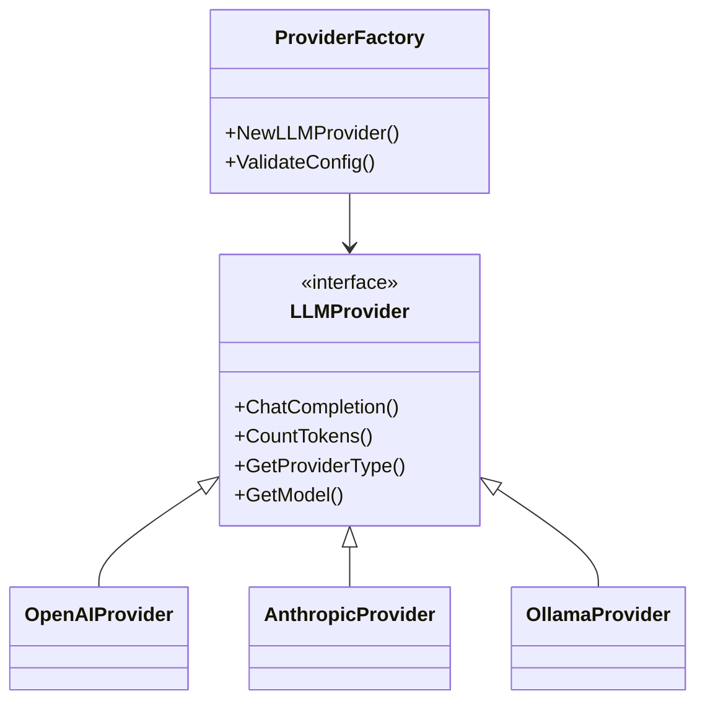
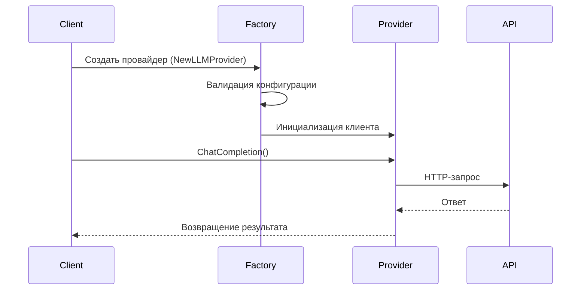

Интерфейсы взаимодействия с LLM и эмбеддинг-провайдерами. Спецификации запросов/ответов для OpenAI, Anthropic, Ollama.

````markdown
# API и сервисы

## 1. Обзор

Страница описывает интерфейсы взаимодействия с LLM и эмбеддинг-провайдерами в DeepWiki. Включает спецификации запросов/ответов для OpenAI, Anthropic и Ollama, а также детали реализации клиентских библиотек.

## 2. Диаграммы

### 2.1. Архитектура взаимодействия с провайдерами


````

### 2.2. Жизненный цикл запроса к LLM



## 3. Ключевые концепции

### 3.1. Типы провайдеров

Поддерживаются три типа провайдеров:

```go
const (
    ProviderOpenAI    ProviderType = "openai"
    ProviderAnthropic ProviderType = "anthropic"
    ProviderOllama    ProviderType = "ollama"
)
```

### 3.2. Интерфейс провайдера

```go
type Provider interface {
    ChatCompletion(ctx context.Context, messages []Message, opts ...ChatCompletionOptions) (*ChatCompletionResponse, error)
    CountTokens(text string) (int, error)
    GetProviderType() ProviderType
    GetModel() string
    GetUsageStats() TokenCount
}
```

## 4. Реализация

### 4.1. Конфигурация

Структура конфигурации:

```go
type Config struct {
    Provider      ProviderType `yaml:"provider"`
    APIKey        string       `yaml:"api_key"`
    Model         string       `yaml:"model"`
    MaxTokens     int          `yaml:"max_tokens"`
    Temperature   float64      `yaml:"temperature"`
    BaseURL       string       `yaml:"base_url,omitempty"`
    // ...другие поля
}
```

### 4.2. Валидация конфигурации

```go
func ValidateConfig(config *Config) error {
    if config == nil {
        return fmt.Errorf("config cannot be nil")
    }

    switch config.Provider {
    case ProviderOpenAI, ProviderAnthropic:
        if config.APIKey == "" {
            return fmt.Errorf("API key is required for provider %s", config.Provider)
        }
    case ProviderOllama:
        if config.BaseURL == "" {
            return fmt.Errorf("base_url is required for Ollama provider")
        }
    }

    if config.MaxTokens <= 0 {
        return fmt.Errorf("max_tokens must be positive")
    }
    // ...другие проверки
}
```

### 4.3. Обработка ошибок

Пример обработки ошибок в тестах:

```go
tests := []struct {
    name      string
    config    *Config
    wantErr   bool
    errMsg    string
}{
    {
        name: "OpenAI без API ключа",
        config: &Config{
            Provider: ProviderOpenAI,
            Model:    "gpt-4o",
        },
        wantErr: true,
        errMsg:  "API key is required",
    },
    // ...другие тест-кейсы
}
```

## 5. Примеры использования

### 5.1. Создание провайдера OpenAI

```go
config := &llm.Config{
    Provider:      llm.ProviderOpenAI,
    APIKey:        "your-api-key",
    Model:         "gpt-4o",
    MaxTokens:     4000,
    Temperature:   0.1,
    RequestTimeout: 3 * time.Minute,
}

provider, err := llmfactory.NewLLMProvider(config)
if err != nil {
    log.Fatalf("Failed to create provider: %v", err)
}
```

### 5.2. Вызов ChatCompletion

```go
messages := []llm.Message{
    {Role: "user", Content: "Как работает RAG?"},
}

response, err := provider.ChatCompletion(context.Background(), messages)
if err != nil {
    log.Fatalf("ChatCompletion error: %v", err)
}

fmt.Printf("Ответ: %s\n", response.Choices[0].Message.Content)
```

## 6. Справочные таблицы

### 6.1. Параметры конфигурации

| Параметр    | Описание               | Обязательный         | Значение по умолчанию  |
| ----------- | ---------------------- | -------------------- | ---------------------- |
| provider    | Тип провайдера         | Да                   | -                      |
| api_key     | API-ключ               | Для OpenAI/Anthropic | -                      |
| model       | Модель LLM             | Да                   | Зависит от провайдера  |
| max_tokens  | Макс. токенов в ответе | Нет                  | 4000                   |
| temperature | Температура генерации  | Нет                  | 0.1                    |
| base_url    | Базовый URL для Ollama | Для Ollama           | http://localhost:11434 |

### 6.2. Методы интерфейса Provider

| Метод           | Описание                             |
| --------------- | ------------------------------------ |
| ChatCompletion  | Генерация ответа на основе сообщений |
| CountTokens     | Подсчет токенов в тексте             |
| GetProviderType | Получение типа провайдера            |
| GetModel        | Получение используемой модели        |
| GetUsageStats   | Получение статистики использования   |

## 7. Особенности и подводные камни

### 7.1. Частые ошибки

1. **Отсутствие API-ключа**:

   ```text
   API key is required for provider openai
   ```

   Решение: Убедитесь, что вы установили `OPENAI_API_KEY` или передали ключ в конфигурации.

2. **Неверный URL для Ollama**:

   ```text
   base_url is required for Ollama provider
   ```

   Решение: Укажите `BaseURL` в конфигурации или установите переменную окружения `DEEPWIKI_LLM_BASE_URL`.

3. **Отрицательное значение max_tokens**:
   ```text
   max tokens cannot be negative
   ```
   Решение: Убедитесь, что `MaxTokens` > 0.

### 7.2. Особенности провайдеров

- **Ollama**: Не требует API-ключа, но требует запущенного локального сервера
- **OpenAI**: Использует фиксированные цены на токены для оценки стоимости
- **Anthropic**: Поддерживает стриминговые ответы

### 7.3. Производительность

- **RateLimitRPS**: Ограничение скорости запросов (по умолчанию 2.0 для OpenAI/Anthropic)
- **MaxRetries**: Максимальное количество попыток (по умолчанию 3)
- **RetryDelay**: Задержка между попытками (по умолчанию 1 секунда)
