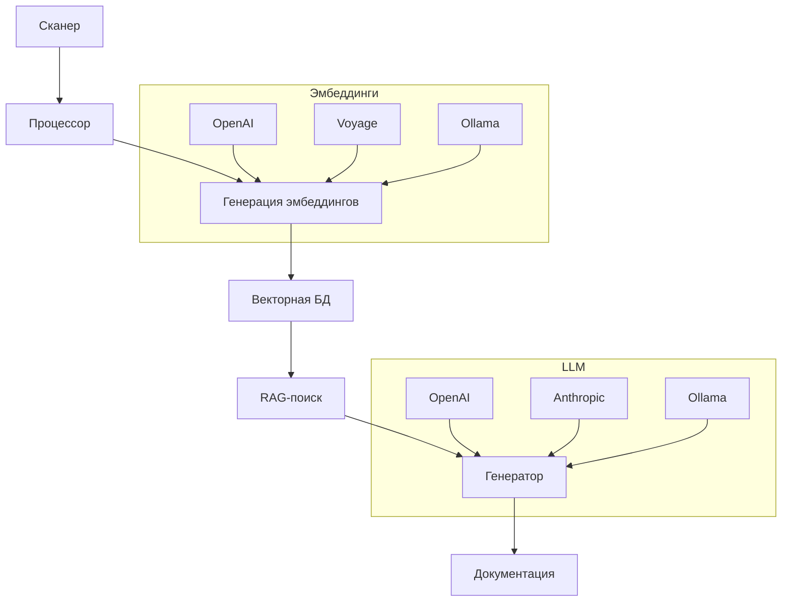

Высокоуровневая схема компонентов: сканер, процессор, эмбеддинги, RAG, генератор. Диаграмма потока данных между модулями.

# Архитектура системы

## 1. Обзор

DeepWiki представляет собой систему, автоматически генерирующую документацию из исходного кода. Основные компоненты:

- **Сканер** анализирует кодовую базу
- **Процессор** извлекает и структурирует данные
- **Эмбеддинги** создают векторные представления
- **RAG (Retrieval-Augmented Generation)** обеспечивает контекстуальный поиск
- **Генератор** создает финальную документацию

Компоненты взаимодействуют через четко определенные интерфейсы, что позволяет гибко настраивать реализацию каждого модуля.

## 2. Диаграмма архитектуры



## 3. Ключевые концепции и ответственность

### 3.1 Сканер (pkg/scanner/)

- Анализирует файловую систему и исходный код
- Поддерживает фильтрацию по расширениям и паттернам
- Реализация: `scanner.go` через интерфейс `Scanner`

### 3.2 Процессор (pkg/processor/)

- Парсит код в структурированные данные
- Обрабатывает комментарии и docstrings
- Код: `processor.go` с интерфейсом `Processor`

### 3.3 Эмбеддинги (pkg/embedding/)

- Генерируют векторные представления текста
- Поддерживают провайдеров: OpenAI, Voyage, Ollama
- Архитектура: фабрика `factory.go` + провайдеры

### 3.4 RAG (pkg/rag/)

- Реализует контекстуальный поиск по векторной БД
- Использует `retriever.go` для поиска релевантных фрагментов

### 3.5 Генератор (pkg/generator/)

- Создает документацию с использованием LLM
- Поддерживает шаблоны и кастомизацию вывода
- Основные файлы: `generator.go`, `content.go`

## 4. Реализация и детали

### 4.1 Сканер

```go
// pkg/scanner/scanner.go
func (s *CodeScanner) Scan(path string) ([]*FileContent, error) {
    var results []*FileContent
    err := filepath.Walk(path, func(path string, info os.FileInfo, err error) error {
        if s.isIgnored(path) || !s.isSupportedExt(info) {
            return nil
        }
        content, _ := os.ReadFile(path)
        results = append(results, &FileContent{
            Path:    path,
            Content: string(content),
        })
        return nil
    })
    return results, err
}
```

### 4.2 Генерация эмбеддингов

```go
// pkg/embedding/factory/factory.go
func NewEmbeddingProvider(cfg *Config) (EmbeddingProvider, error) {
    switch cfg.Provider {
    case "openai":
        return openai.NewProvider(cfg.OpenAISettings)
    case "voyage":
        return voyage.NewProvider(cfg.VoyageSettings)
    case "ollama":
        return ollama.NewProvider(cfg.OllamaSettings)
    default:
        return nil, fmt.Errorf("unsupported provider: %s", cfg.Provider)
    }
}
```

### 4.3 Обработка ошибок

```go
// pkg/generator/generator.go
func (g *DocGenerator) Generate(ctx context.Context, input *GenerationInput) (*GenerationOutput, error) {
    if input == nil {
        return nil, errors.New("input cannot be nil")
    }

    if len(input.Content) > MaxContextLength {
        return nil, fmt.Errorf("content exceeds max length: %d", MaxContextLength)
    }

    // Генерация документации
    response, err := g.llmClient.Call(ctx, input.Prompt)
    if err != nil {
        return nil, fmt.Errorf("llm call failed: %w", err)
    }

    return &GenerationOutput{Content: response}, nil
}
```

## 5. Примеры использования

### 5.1 Генерация документации

```bash
deepwiki generate \
  --source ./my-project \
  --output ./docs \
  --llm-provider openai \
  --embedding-provider voyage
```

### 5.2 Конфигурация (example-config.yaml)

```yaml
providers:
  llm:
    type: anthropic
    api_key: $ANTHROPIC_API_KEY
  embedding:
    type: openai
    api_key: $OPENAI_API_KEY
scanner:
  extensions: [".py", ".js"]
generator:
  template: "wiki"
```

## 6. Таблица провайдеров

| Тип        | Поддерживаемые провайдеры | Конфигурационные параметры  |
| ---------- | ------------------------- | --------------------------- |
| LLM        | OpenAI, Anthropic, Ollama | API-ключи, модели, таймауты |
| Эмбеддинги | OpenAI, Voyage, Ollama    | API-ключи, размер векторов  |

## 7. Особенности и подводные камни

### 7.1 Ошибки векторного поиска

```go
// pkg/rag/retriever.go
func (r *VectorRetriever) Search(query string) ([]*Result, error) {
    vectors, err := r.embeddingProvider.GetEmbeddings(query)
    if err != nil {
        return nil, fmt.Errorf("failed to get query embedding: %w", err)
    }

    if len(vectors) == 0 {
        return nil, errors.New("empty embedding vector")
    }

    // Поиск в векторной БД
    return r.vectorDB.Query(vectors[0], 5)
}
```

### 7.2 Рекомендации

- Используйте провайдеров с высокой точностью эмбеддингов для сложных проектов
- Настройте `max_context_length` в конфиге для предотвращения переполнения
- Для больших проектов включите кэширование эмбеддингов
