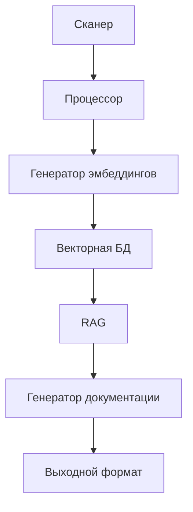
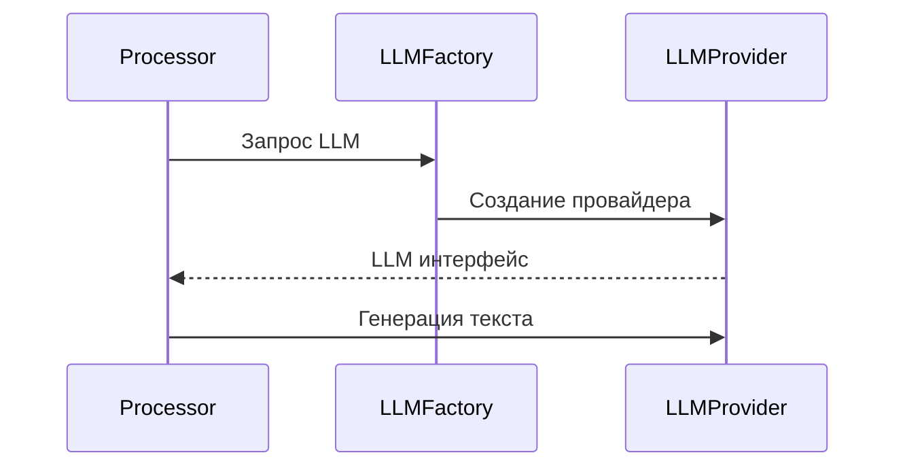

Детализация ключевых модулей: сканер, процессор, эмбеддинги, RAG, генератор. Диаграммы взаимодействия.

# Компоненты и модули

## 1. Обзор

Страница описывает ключевые модули системы DeepWiki: сканер, процессор, эмбеддинги, RAG и генератор. Показаны их взаимодействие и реализация на основе исходного кода. Более высокий уровень архитектуры описан в разделе [Архитектура системы](архитектура-системы.md).

## 2. Диаграммы взаимодействия

### 2.1 Поток данных между модулями



### 2.2 Взаимодействие с LLM



## 3. Ключевые концепции и ответственность

### 3.1 Сканер (pkg/scanner)

- **Ответственность**: Анализ исходного кода, определение структуры проекта
- **Ключевые методы**:
  ```go
  // pkg/scanner/scanner.go
  func (s *Scanner) Scan(path string) (*ProjectStructure, error) {
    // Рекурсивный обход файлов
    // Парсинг метаданных
    // Фильтрация по .deepwiki.yaml
  }
  ```

### 3.2 Процессор (pkg/processor)

- **Ответственность**: Обработка данных между этапами, управление контекстом
- **Особенности**:
  ```go
  // pkg/processor/processor.go
  func (p *Processor) Process(ctx context.Context, data InputData) (OutputData, error) {
    // Валидация входных данных
    // Параллельная обработка
    // Кэширование промежуточных результатов
  }
  ```

### 3.3 Эмбеддинги (pkg/embeddings)

- **Ответственность**: Генерация векторных представлений
- **Архитектура**:
  ```mermaid
  classDiagram
    class EmbeddingGenerator {
      +Generate(text string) ([]float32, error)
    }
    class VectorDB {
      +Store(id string, vector []float32)
      +Search(query []float32) []Result
    }
    EmbeddingGenerator --> VectorDB
  ```

### 3.4 RAG (pkg/rag)

- **Ответственность**: Извлечение контекста из векторной БД
- **Ключевая логика**:
  ```go
  // pkg/rag/retriever.go
  func (r *Retriever) GetContext(query string) (Context, error) {
    // Генерация эмбеддинга запроса
    // Поиск ближайших векторов
    // Формирование контекста
  }
  ```

### 3.5 Генератор (pkg/generator)

- **Ответственность**: Создание документации с использованием LLM
- **Реализация**:
  ```go
  // pkg/generator/generator.go
  func (g *Generator) GenerateDoc(ctx context.Context, prompt Prompt) (string, error) {
    // Загрузка шаблона
    // Вызов LLM
    // Постобработка результата
  }
  ```

## 4. Реализация деталей

### 4.1 Фабрики провайдеров

```go
// pkg/embedding/factory/factory.go
func NewProvider(cfg Config) (EmbeddingProvider, error) {
  switch cfg.Type {
  case "openai":
    return newOpenAIProvider(cfg)
  case "ollama":
    return newOllamaProvider(cfg)
  case "voyage":
    return newVoyageProvider(cfg)
  default:
    return nil, ErrUnknownProvider
  }
}
```

### 4.2 Обработка ошибок

```go
// pkg/scanner/scanner_test.go
func TestScanner_InvalidPath(t *testing.T) {
  scanner := NewScanner()
  _, err := scanner.Scan("/invalid/path")
  assert.Error(t, err)
  assert.Contains(t, err.Error(), "directory not found")
}
```

## 5. Примеры использования

### 5.1 Генерация эмбеддинга

```go
// Пример использования
embFactory := embedding.NewFactory(config)
provider, _ := embFactory.Create("openai")
vector, _ := provider.Generate("Пример текста")
fmt.Println("Вектор:", vector[:5]) // [0.12 -0.45 0.67 ...]
```

### 5.2 RAG-запрос

```bash
# CLI-пример (cmd/root.go)
deepwiki rag --query "Как работает сканер?" \
            --top-k 3 \
            --provider openai
```

## 6. Таблицы

### 6.1 Поддерживаемые провайдеры

| Модуль     | Поддерживаемые провайдеры |
| ---------- | ------------------------- |
| Эмбеддинги | OpenAI, Voyage, Ollama    |
| LLM        | OpenAI, Anthropic, Ollama |

### 6.2 Параметры сканера

| Параметр     | Описание                  |
| ------------ | ------------------------- |
| `--exclude`  | Паттерны исключений       |
| `--lang`     | Языки программирования    |
| `--metadata` | Дополнительные метаданные |

## 7. Особенности реализации

### 7.1 Обработка больших файлов

```go
// pkg/processor/processor.go
func chunkProcessing(data []byte) [][]byte {
  const maxChunk = 1024 * 1024 // 1MB
  if len(data) > maxChunk {
    return splitByLines(data) // Разделение по логическим блокам
  }
  return [][]byte{data}
}
```

### 7.2 Кэширование

```go
// pkg/embeddings/vectordb.go
var cache = make(map[string][]float32)

func (v *VectorDB) GetCached(id string) ([]float32, bool) {
  vec, ok := cache[id]
  return vec, ok
}
```

## См. также

- [Архитектура системы](архитектура-системы.md)
- [API и сервисы](api-и-сервисы.md)
- [Обработка данных](обработка-данных.md)
