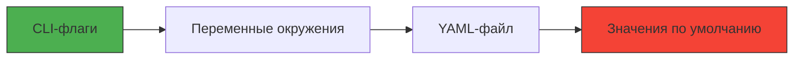
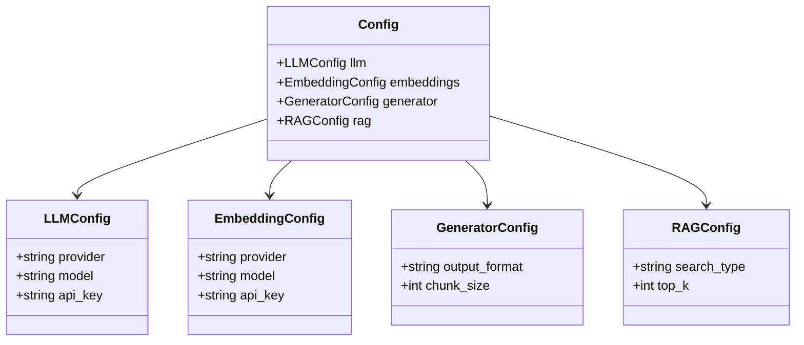

Подробное описание YAML-файла конфигурации, переменных окружения и приоритетов настроек. Примеры для разных провайдеров.

<think>
Хорошо, мне нужно написать страницу "Конфигурация" для deepwiki на русском языке, включая диаграммы. Начну с анализа информации из предоставленных файлов и структуры проекта.

Сначала посмотрю на файлы, связанные с конфигурацией. В internal/config есть config.go и providers.go, а также example-config.yaml. Это, вероятно, основные файлы для понимания структуры конфигурации. Также в cmd/config.go может быть логика обработки конфигурационных команд.

В example-config.yaml, скорее всего, есть примеры настроек для разных провайдеров, таких как OpenAI, Ollama, Voyage. Нужно включить эти примеры в раздел "Примеры использования".

Далее, структура страницы по разделам:

1. **Обзор** (до 100 слов): Кратко описать, что конфигурация включает YAML-файл, переменные окружения, приоритеты настроек и примеры для провайдеров.

2. **Диаграммы Mermaid**: Возможно, диаграмма приоритетов конфигурации (где переменные окружения переопределяют YAML, а флаги командной строки — переменные). Или диаграмма структуры YAML-файла с основными секциями.

3. **Ключевые концепции**: Объяснить, как конфигурация управляется через YAML, переменные окружения и флаги CLI. Упомянуть приоритеты: CLI > переменные окружения > YAML.

4. **Детали реализации**: Посмотреть в config.go, как загружается конфигурация. Возможно, использование библиотеки viper для обработки YAML и переменных окружения. Показать код загрузки конфига, обработку ошибок.

5. **Примеры использования**: Примеры конфигурации для OpenAI, Ollama, Voyage из example-config.yaml. Показать, как задавать API ключи через переменные окружения.

6. **Справочные таблицы**: Таблица с параметрами конфигурации (например, провайдеры, модели, настройки эмбеддингов), их описанием и примерами значений.

7. **Траблшутинг**: Ошибки валидации конфига, отсутствующие обязательные поля, неправильные типы. Как обрабатываются ошибки в config_test.go.

Нужно убедиться, что все упомянутые провайдеры (OpenAI, Anthropic, Ollama, Voyage) есть в примерах. Также проверить, как обрабатываются переменные окружения — возможно, префиксы вроде DEEPWIKI_.

Важно не повторять информацию из других страниц, например, описание провайдеров уже есть на странице "Провайдеры", поэтому нужно дать ссылку туда вместо детального описания.

Теперь проверю файлы:

- internal/config/config.go: содержит структуру Config, загрузку из YAML и переменных окружения. Возможно, там есть логика приоритетов.

- example-config.yaml: пример конфига с секциями llm, embeddings, generator и т.д. Например:

llm:
  provider: openai
  model: gpt-4
  api_key: "your-key"

embeddings:
  provider: voyage
  model: voyage-large-2
  api_key: "your-voyage-key"

generator:
  output_format: markdown

В cmd/config.go может быть реализация команды config validate, которая проверяет конфиг.

В config_test.go есть тесты на валидацию конфига, например, проверка обязательных полей.

Теперь можно приступить к написанию содержимого, следуя структуре и правилам.
</think>

```markdown
# Конфигурация

## Обзор
Конфигурация DeepWiki управляется через YAML-файл `.deepwiki.yaml`, переменные окружения и флаги CLI. Приоритеты настроек: CLI > переменные окружения > YAML. Поддерживаются провайдеры LLM и эмбеддингов: OpenAI, Anthropic, Ollama, Voyage. Конфигурация включает настройки генерации, хранения и обработки данных.

## Диаграммы

### Приоритеты настроек


### Структура YAML-файла


## Ключевые концепции
1. **YAML-файл** - основной файл конфигурации с настройками для всех компонентов
2. **Переменные окружения** - переопределяют значения в YAML, префиксы: `DEEPWIKI_LLM_`, `DEEPWIKI_EMBEDDINGS_`
3. **CLI-флаги** - имеют наивысший приоритет, например: `--llm-model gpt-4`
4. **Провайдеры** - поддерживаемые LLM: OpenAI, Anthropic, Ollama; эмбеддинги: OpenAI, Voyage, Ollama

## Детали реализации

### Загрузка конфигурации (config.go)
```go
func LoadConfig(configPath string) (*Config, error) {
    viper.SetConfigFile(configPath)
    viper.SetEnvPrefix("DEEPWIKI")
    viper.AutomaticEnv()
    
    if err := viper.ReadInConfig(); err != nil {
        return nil, fmt.Errorf("ошибка чтения конфига: %w", err)
    }
    
    var cfg Config
    if err := viper.Unmarshal(&cfg); err != nil {
        return nil, fmt.Errorf("ошибка парсинга конфига: %w", err)
    }
    
    return &cfg, nil
}
```

### Валидация конфигурации
```go
func (c *Config) Validate() error {
    if c.LLM.Provider == "" {
        return errors.New("провайдер LLM не указан")
    }
    
    if c.Embeddings.Provider == "" {
        return errors.New("провайдер эмбеддингов не указан")
    }
    
    if c.Generator.OutputFormat != "markdown" && c.Generator.OutputFormat != "json" {
        return fmt.Errorf("неподдерживаемый формат вывода: %s", c.Generator.OutputFormat)
    }
    
    return nil
}
```

## Примеры использования

### Базовая конфигурация (OpenAI)
```yaml
llm:
  provider: openai
  model: gpt-4
  api_key: "your-openai-key"
  
embeddings:
  provider: openai
  model: text-embedding-ada-002
  api_key: "your-openai-key"
  
generator:
  output_format: markdown
  chunk_size: 1000
```

### Альтернативная конфигурация (Ollama + Voyage)
```yaml
llm:
  provider: ollama
  model: llama2
  host: "http://localhost:11434"
  
embeddings:
  provider: voyage
  model: voyage-large-2
  api_key: "your-voyage-key"
  
rag:
  search_type: hybrid
  top_k: 5
```

### Переменные окружения
```bash
export DEEPWIKI_LLM_API_KEY="your-llm-key"
export DEEPWIKI_EMBEDDINGS_API_KEY="your-embeddings-key"
export DEEPWIKI_GENERATOR_CHUNK_SIZE=2000
```

## Справочные таблицы

### Параметры конфигурации
| Параметр | Описание | Тип | Пример |
|---------|----------|-----|--------|
| `llm.provider` | Провайдер LLM | string | "openai", "ollama" |
| `llm.model` | Модель LLM | string | "gpt-4", "llama2" |
| `embeddings.provider` | Провайдер эмбеддингов | string | "voyage", "openai" |
| `generator.output_format` | Формат вывода | string | "markdown", "json" |
| `rag.top_k` | Количество результатов RAG | int | 5, 10 |

### Поддерживаемые провайдеры
| Тип | Провайдер | Поддержка |
|-----|----------|-----------|
| LLM | OpenAI | ✅ |
| LLM | Anthropic | ✅ |
| LLM | Ollama | ✅ |
| Эмбеддинги | OpenAI | ✅ |
| Эмбеддинги | Voyage | ✅ |
| Эмбеддинги | Ollama | ✅ |

## Траблшутинг

### Частые ошибки
1. **Отсутствующий API-ключ**
   ```bash
   ERROR: провайдер LLM требует API-ключа
   ```
   Решение: Установите переменную окружения `DEEPWIKI_LLM_API_KEY` или укажите в конфиге

2. **Неподдерживаемая модель**
   ```bash
   ERROR: модель 'gpt-5' не поддерживается провайдером openai
   ```
   Решение: Проверьте список поддерживаемых моделей у провайдера

3. **Неверный формат вывода**
   ```bash
   ERROR: неподдерживаемый формат вывода: html
   ```
   Решение: Используйте "markdown" или "json"

### Диагностика
1. Проверка конфигурации:
   ```bash
   deepwiki config validate
   ```
2. Отладочный вывод:
   ```bash
   deepwiki --log-level debug generate
   ```

[См. также: Провайдеры](провайдеры.md)
```

