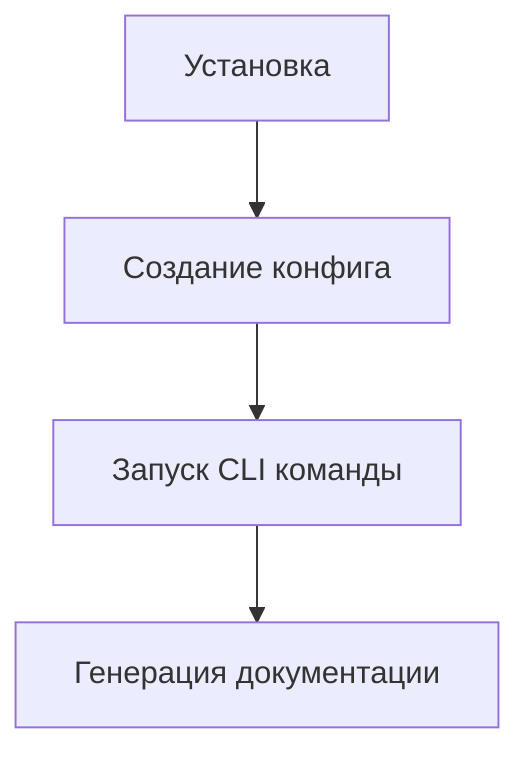
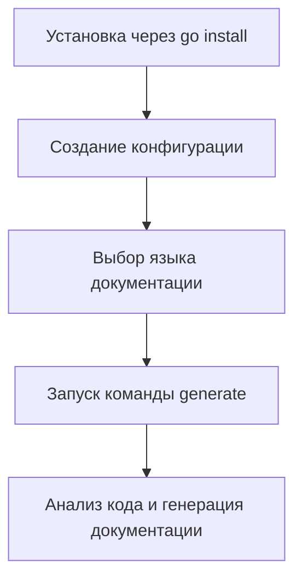
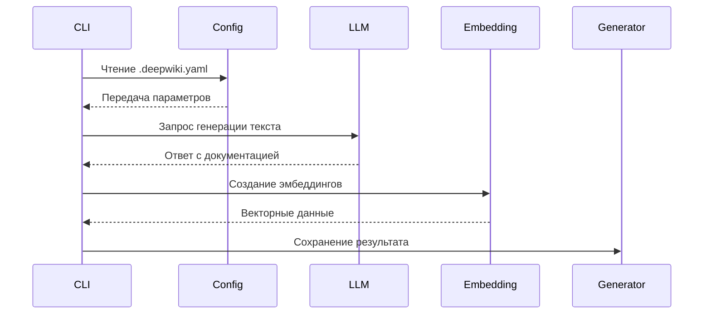

Инструкция по установке, запуску и первому использованию CLI. Примеры команд и минимальной конфигурации.

<think>
Хорошо, мне нужно написать страницу "Начало работы" для deepwiki на русском языке, включая диаграммы. Начну с понимания задачи и доступных данных.

Сначала посмотрю на описание страницы: это инструкция по установке, запуску и первому использованию CLI с примерами команд и минимальной конфигурации. Значит, нужно описать шаги установки, настройки, базовые команды и показать примеры.

Из источников у меня есть файлы, связанные с CLI (cmd/), конфигурацией (.deepwiki.yaml, example-config.yaml), а также информация о языках в pkg/types/language.go. Также есть .golangci.yml, но, возможно, он не нужен для этой страницы.

Проверю структуру проекта. В cmd/ есть root.go, generate.go, config.go — это основные команды CLI. В examples/ есть tutorial.md, возможно, там есть примеры. Также есть example-config.yaml для демонстрации конфигурации.

Теперь нужно составить структуру страницы по плану:

1. Overview (до 100 слов) — краткое введение о том, что страница поможет начать работу с deepwiki через CLI: установка, настройка, первые команды.

2. Диаграммы Mermaid. Поскольку это начало работы, возможно, flowchart TD для процесса установки и запуска, или sequenceDiagram для взаимодействия CLI с системой. Нужно выбрать подходящий тип.

3. Ключевые концепции: CLI-команды (generate, config), конфигурационный файл, поддерживаемые языки, провайдеры LLM и эмбеддингов.

4. Реализация: код из cmd/root.go, generate.go, config.go, примеры обработки флагов, чтения конфига. Показать, как обрабатываются ошибки, например, в ParseLanguageWithCode.

5. Примеры использования: команды generate с минимальной конфигурацией, установка языка, проверка конфига.

6. Таблицы: возможно, флаги команд или параметры конфигурации, но если это уже есть на странице "CLI-команды" или "Конфигурация", то ссылка.

7. Траблшутинг: ошибки при парсинге языка, отсутствующий конфиг, неверные флаги.

Теперь проверю, какие страницы уже существуют. Например, "CLI-команды" и "Конфигурация" уже описаны, поэтому не нужно повторять детали, только ссылки.

Начну с Overview: кратко о том, что страница поможет установить deepwiki, настроить и запустить первую генерацию документации через CLI.

Диаграммы: flowchart TD для процесса установки и запуска. Например:



Но нужно убедиться, что это соответствует реальному процессу. Возможно, добавить проверку конфига или выбор языка.

Ключевые концепции: CLI-интерфейс, конфигурационный файл, поддержка языков (en/ru), провайдеры LLM и эмбеддингов.

Реализация: в pkg/types/language.go есть ParseLanguageWithCode, который обрабатывает язык через код или название. В cmd/root.go инициализация флагов, например, --language с поддержкой "en" или "ru".

Примеры команд:

```bash
deepwiki generate --input ./src --output ./docs
deepwiki config init
```

Минимальная конфигурация из example-config.yaml:

```yaml
language: ru
llm:
  provider: openai
  api_key: YOUR_KEY
```

Траблшутинг: если указан неподдерживаемый язык, возвращается ошибка с поддерживаемыми вариантами.

Проверю, нет ли дублирования с другими страницами. Например, CLI-команды уже описаны на своей странице, поэтому нужно дать ссылку, а здесь привести только базовые примеры.

Теперь структурирую всё в markdown, соблюдая правила: только русский, диаграммы валидные, код с подсветкой, ссылки на другие страницы вместо повторов.
</think>

```markdown
# Начало работы с DeepWiki

## 1. Обзор (≤ 100 слов)
DeepWiki — это инструмент для автоматической генерации документации по исходному коду. Эта страница поможет вам установить CLI, настроить минимальную конфигурацию и запустить первую генерацию документации. Поддерживается работа с LLM-провайдерами (OpenAI, Anthropic, Ollama) и эмбеддинг-сервисами (Voyage, Ollama). Для работы потребуется Go 1.21+ и конфигурационный файл `.deepwiki.yaml`.

---

## 2. Диаграммы Mermaid

### Процесс установки и запуска


### Взаимодействие CLI с системой


---

## 3. Ключевые концепции
- **CLI-интерфейс**: Основные команды `generate`, `config`, `validate` (см. [CLI-команды](CLI-команды.md))
- **Конфигурационный файл**: `.deepwiki.yaml` с настройками LLM, эмбеддингов и языка
- **Поддержка языков**: `en` (по умолчанию) и `ru` (через флаг `--language`)
- **Провайдеры**: OpenAI, Anthropic, Ollama для LLM; Voyage, Ollama для эмбеддингов

---

## 4. Реализация

### Обработка языка в CLI
```go
// cmd/root.go
func init() {
    rootCmd.PersistentFlags().String("language", "en", "Язык документации (en/ru)")
    // ...
}

// pkg/types/language.go
func ParseLanguageWithCode(s string) (Language, error) {
    s = strings.TrimSpace(s)
    if lang, err := ParseLanguage(s); err == nil {
        return lang, nil
    }
    switch strings.ToLower(s) {
    case "en": return LanguageEnglish, nil
    case "ru": return LanguageRussian, nil
    }
    return "", fmt.Errorf("unsupported language: %s (supported: English/en, Russian/ru)", s)
}
```

### Чтение конфигурации
```go
// internal/config/config.go
func LoadConfig(path string) (*Config, error) {
    data, err := os.ReadFile(path)
    if err != nil {
        return nil, fmt.Errorf("не удалось прочитать конфиг: %w", err)
    }
    
    var cfg Config
    if err := yaml.Unmarshal(data, &cfg); err != nil {
        return nil, fmt.Errorf("ошибка в YAML: %w", err)
    }
    return &cfg, nil
}
```

---

## 5. Примеры использования

### Установка CLI
```bash
go install gitlab.tcsbank.ru/infra-dev/deepwiki/cmd/deepwiki@latest
```

### Инициализация конфигурации
```bash
deepwiki config init --language ru
# Создаст .deepwiki.yaml с настройками по умолчанию
```

### Минимальная конфигурация
```yaml
# .deepwiki.yaml
language: ru
llm:
  provider: openai
  api_key: YOUR_OPENAI_KEY
```

### Генерация документации
```bash
deepwiki generate --input ./pkg --output ./docs
# Сгенерирует документацию для кода в ./pkg
```

---

## 6. Справочные таблицы

### Поддерживаемые флаги CLI
| Флаг | Описание | Пример значения |
|------|----------|-----------------|
| `--language` | Язык документации | `en`, `ru` |
| `--input` | Путь к исходному коду | `./pkg` |
| `--output` | Путь для сохранения | `./docs` |

### Коды ошибок
| Код | Сообщение | Причина |
|-----|----------|--------|
| 1 | `unsupported language` | Неверный код языка |
| 2 | `config not found` | Отсутствует .deepwiki.yaml |
| 3 | `LLM provider error` | Ошибка API провайдера |

---

## 7. Траблшутинг

### Ошибка парсинга языка
```bash
unsupported language: fr (supported: English/en, Russian/ru)
```
**Решение**: Используйте `en` или `ru` в флаге `--language`.

### Отсутствующий конфиг
```bash
не удалось прочитать конфиг: open .deepwiki.yaml: no such file
```
**Решение**: Создайте конфиг через `deepwiki config init`.

### Неверный API-ключ
```bash
LLM provider error: invalid API key
```
**Решение**: Проверьте `api_key` в конфигурации.

---

> Для расширенной настройки провайдеров см. [Провайдеры](Провайдеры.md).  
> Для деталей CLI-команд см. [CLI-команды](CLI-команды.md).
```

