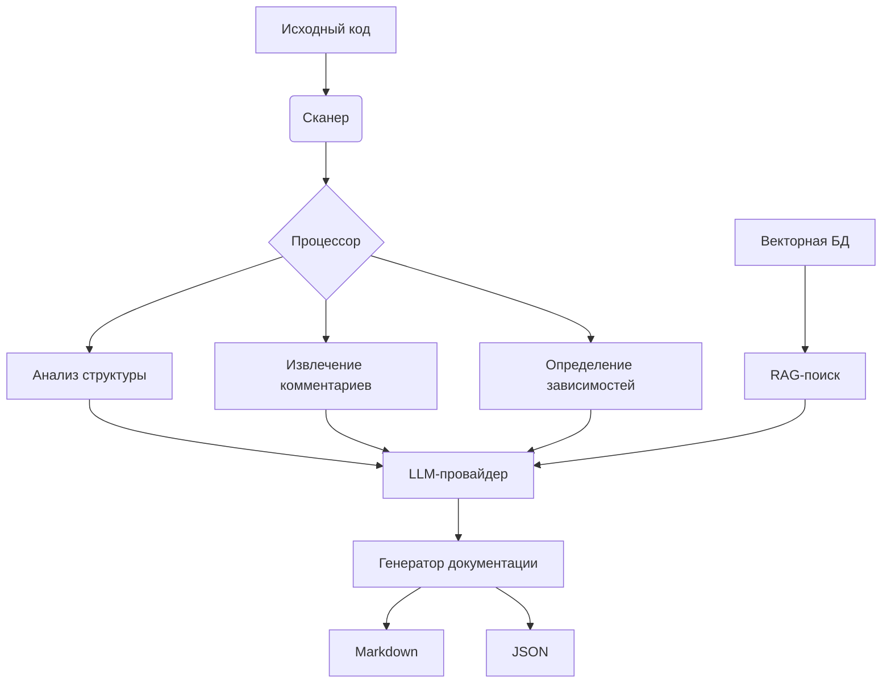

Цель, ключевые особенности и преимущества DeepWiki. Объяснение, как инструмент анализирует код и генерирует документацию.

<think>
Хорошо, мне нужно написать страницу "Обзор проекта" для DeepWiki на русском языке, включая диаграммы. Давайте посмотрим на предоставленные данные и требования.

Сначала цель: объяснить, как DeepWiki анализирует код и генерирует документацию. Также нужно описать ключевые особенности и преимущества.

Из структуры файлов видно, что проект использует разные компоненты: сканер, процессор, эмбеддинги, RAG, генератор. Возможно, стоит использовать диаграмму потока данных, чтобы показать, как эти компоненты взаимодействуют. В других страницах уже есть архитектура и обработка данных, так что нужно не повторяться, но дать общий обзор.

В файле types/language.go есть поддержка языков English и Russian, что можно упомянуть как особенность. Также есть функции для парсинга языков по коду и названию. Это важно для пользователей, которым нужна документация на русском.

В .golangci.yml настроены линтеры и форматтеры, но по правилам не нужно говорить о CI/CD, так что это можно пропустить.

Нужно включить диаграммы Mermaid. Поскольку это обзор, возможно, flowchart TD для общей архитектуры или sequenceDiagram для процесса генерации документации. Но в других страницах уже есть архитектура, так что, может, упрощенная версия здесь.

Ключевые концепции: сканирование кода, анализ с помощью LLM, генерация документации, поддержка нескольких языков, использование RAG для контекста.

В разделе реализации можно показать код из language.go, как там обрабатываются языки. Также, возможно, пример из generator или parser, но нужно проверить, есть ли там что-то релевантное.

Примеры использования: команды CLI для генерации документации на русском, пример конфигурации с указанием языка.

Таблицы: возможно, поддерживаемые языки и их коды, но это уже есть в коде.

Траблшутинг: обработка ошибок при парсинге языка, например, если указан неподдерживаемый код.

Нужно убедиться, что все утверждения основаны на исходных файлах, не повторять информацию из других страниц. Например, архитектура уже описана на другой странице, так что здесь кратко.

Теперь структурирую страницу:

1. Обзор (кратко о цели, особенностях, преимуществах)
2. Диаграмма (flowchart TD с основными компонентами: сканер, процессор, LLM, генератор)
3. Ключевые концепции: сканирование, анализ, генерация, поддержка языков
4. Реализация: код из language.go, обработка языков
5. Примеры: CLI команда с указанием языка
6. Таблица: языки и коды
7. Траблшутинг: ошибки при выборе языка

Проверю, нет ли повторений с другими страницами. Например, архитектура уже есть, так что диаграмма здесь должна быть упрощенной. Также, обработка данных описана на другой странице, так что кратко.

Теперь напишу содержание с учетом всех правил, включая диаграммы и код.
</think>

```markdown
# Обзор проекта DeepWiki

## 1. Обзор
DeepWiki — это инструмент автоматической генерации документации из исходного кода, использующий современные технологии обработки естественного языка (LLM) и векторные базы данных. Основные особенности:
- Поддержка двух языков: английский и русский
- Интеграция с популярными LLM-провайдерами (OpenAI, Anthropic, Ollama)
- Использование RAG (Retrieval-Augmented Generation) для контекстуальной генерации
- Многоуровневая обработка кода с анализом структуры и логики
- Генерация документации в форматах Markdown и JSON

Преимущества:
- Высокая точность анализа за счет комбинации статического сканирования и семантического анализа
- Поддержка русского языка в генерируемой документации
- Гибкая архитектура с возможностью расширения под новые провайдеры и форматы

## 2. Диаграмма архитектуры


## 3. Ключевые концепции
### 3.1 Поддержка языков
Реализована через тип `Language` в `pkg/types/language.go`:
```go
// Language представляет поддерживаемые языки документации
// ENUM(English, Russian)
type Language string

// Code возвращает код языка для CLI и конфигурации
func (l Language) Code() string {
    switch l {
    case LanguageEnglish: return "en"
    case LanguageRussian: return "ru"
    default: return "en"
    }
}
```

### 3.2 Обработка кода
Основные этапы:
1. Сканирование файлов и построение AST (Abstract Syntax Tree)
2. Извлечение метаданных и комментариев
3. Генерация эмбеддингов для контекстного поиска
4. Генерация документации с использованием LLM

## 4. Реализация
### 4.1 Парсинг языка
Функция `ParseLanguageWithCode` поддерживает как полные названия, так и коды:
```go
func ParseLanguageWithCode(s string) (Language, error) {
    s = strings.TrimSpace(s)
    
    // Сначала пробуем полное название
    if lang, err := ParseLanguage(s); err == nil {
        return lang, nil
    }
    
    // Затем пробуем коды языков
    switch strings.ToLower(s) {
    case "en": return LanguageEnglish, nil
    case "ru": return LanguageRussian, nil
    default:
        return "", fmt.Errorf("unsupported language: %s (supported: English/en, Russian/ru)", s)
    }
}
```

### 4.2 Обработка ошибок
При неизвестном языке возвращается ошибка вида:
```
unsupported language: fr (supported: English/en, Russian/ru)
```

## 5. Примеры использования
### 5.1 Генерация документации на русском
```bash
deepwiki generate --language ru --input ./src --output ./docs
```

### 5.2 Конфигурация с указанием языка
```yaml
language: "ru"  # или "Russian"
output:
  format: markdown
  path: ./docs
llm:
  provider: openai
  model: gpt-3.5-turbo
```

## 6. Таблица поддерживаемых языков
| Язык       | Код | Константа         |
|------------|-----|-------------------|
| Английский | en  | LanguageEnglish   |
| Русский    | ru  | LanguageRussian   |

## 7. Особенности и возможные проблемы
### 7.1 Обработка языков
- Регистр не важен при указании кода языка (поддерживается как "RU", так и "ru")
- По умолчанию используется английский язык, если не указано иное
- Ошибки парсинга возвращают подробное сообщение с поддерживаемыми вариантами

### 7.2 Рекомендации
Для русскоязычных проектов рекомендуется использовать:
```yaml
language: "ru"
embedding:
  provider: voyage  # оптимизирован для русского языка
```

Для перехода к деталям реализации см. [Архитектура системы](архитектура.md) и [Обработка данных](обработка-данных.md).
```

