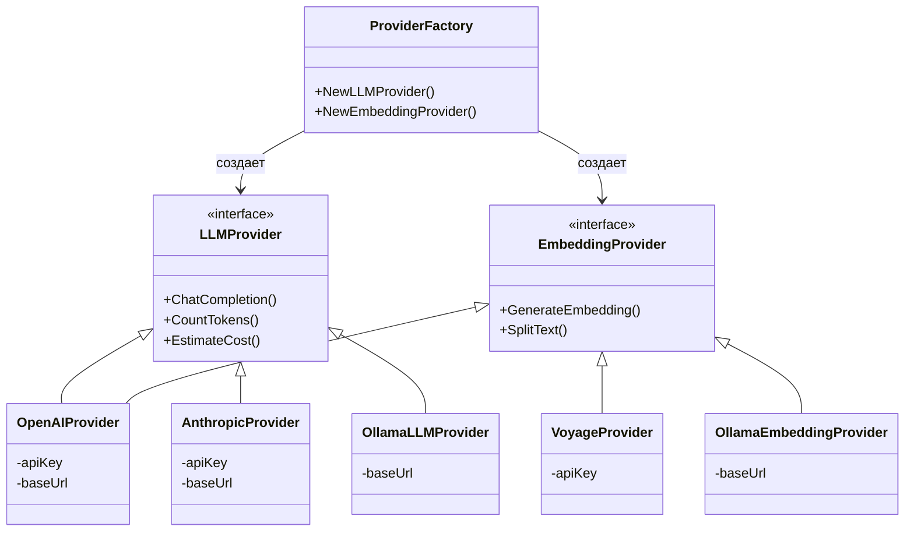
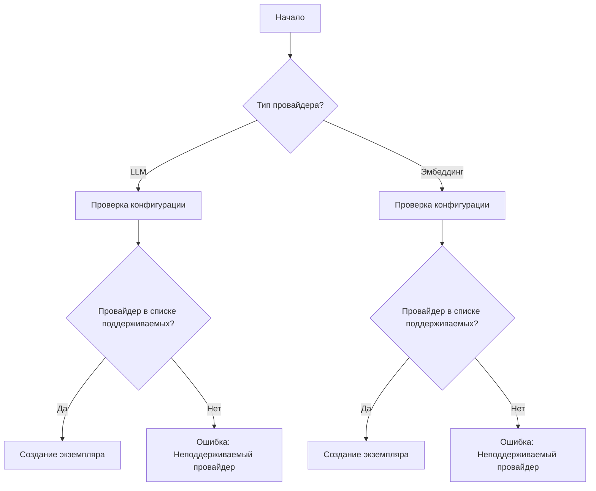

Сравнение LLM и эмбеддинг-провайдеров: OpenAI, Anthropic, Voyage, Ollama. Рекомендации по выбору.

<think>
Хорошо, мне нужно написать страницу "Провайдеры" для deepwiki на русском языке, включая диаграммы. Сначала я должен понять, что требуется по описанию: сравнение LLM и эмбеддинг-провайдеров (OpenAI, Anthropic, Voyage, Ollama) и рекомендации по выбору. 

Смотрю на предоставленные файлы. В config.go есть структуры для провайдеров, включая LLM и Embedding. Также есть примеры конфигураций в .deepwiki.yaml и example-config.yaml. В тестах и фабриках (factory.go) видно, как создаются провайдеры, какие параметры требуются.

Нужно сравнить провайдеров по критериям: тип (LLM или эмбеддинг), модели, требования к API-ключам, базовые URL, параметры конфигурации. Также важно упомянуть, какие провайдеры поддерживаются в коде, их валидацию и обработку ошибок.

Диаграммы: возможно, использовать classDiagram для иерархии провайдеров или flowchart для процесса выбора. Нужно убедиться, что диаграммы соответствуют коду. Например, в коде есть интерфейсы для LLM и Embedding, с разными реализациями.

В разделе "Ключевые концепции" стоит объяснить, что такое провайдеры, их роль в генерации документации. В деталях реализации показать, как создаются провайдеры через фабрики, обработку ошибок (например, проверка API-ключей, валидация параметров).

Примеры использования: как настроить провайдер в конфиге, переменные окружения. Таблицы сравнения провайдеров по поддерживаемым функциям, моделям, требованиям.

Важно не повторять информацию из других страниц, например, конфигурация уже описана на другой странице, поэтому нужно дать ссылку, а не повторять детали.

Проверяю, какие провайдеры поддерживаются: OpenAI, Anthropic, Ollama для LLM; OpenAI, Voyage, Ollama для эмбеддингов. В коде есть валидация для каждого, например, проверка наличия API-ключа для OpenAI и Anthropic, базового URL для Ollama.

Также нужно учесть рекомендации по выбору: например, Ollama не требует API-ключа, можно использовать локально, что дешевле, но возможно меньше функций. OpenAI и Anthropic требуют ключей, но имеют мощные модели. Voyage специализируется на эмбеддингах.

Теперь структурирую страницу по разделам, как указано в плане. Убедиться, что все разделы соответствуют правилам, включая диаграммы и код на русском. Проверю, что примеры кода взяты из исходников и корректны.
</think>

```markdown
# Провайдеры

## 1. Обзор
Провайдеры в DeepWiki — это модули, реализующие интерфейсы взаимодействия с LLM (Large Language Models) и эмбеддинг-моделями. Они обеспечивают генерацию документации, анализ кода и построение векторных представлений. Поддерживаются следующие провайдеры:

- **LLM**: OpenAI, Anthropic, Ollama
- **Эмбеддинги**: OpenAI, Voyage, Ollama

[Конфигурация провайдеров](Конфигурация.md) описана в отдельной статье.

## 2. Диаграммы

### 2.1 Архитектура провайдеров


### 2.2 Процесс выбора провайдера


## 3. Ключевые концепции

### 3.1 Ответственность провайдеров
- **LLM-провайдеры**:
  - Генерация текста документации
  - Анализ кода и извлечение информации
  - Подсчет токенов и оценка стоимости
- **Эмбеддинг-провайдеры**:
  - Генерация векторных представлений текста
  - Разбиение текста на части для обработки
  - Оценка максимальной длины текста

### 3.2 Поддерживаемые модели
| Провайдер       | LLM-модели                          | Эмбеддинг-модели                  |
|----------------|-----------------------------------|-----------------------------------|
| OpenAI         | gpt-4o, gpt-4-turbo, gpt-3.5-turbo | text-embedding-3-small, text-embedding-3-large |
| Anthropic      | claude-3-5-sonnet, claude-3-haiku  | -                                 |
| Voyage         | -                                 | voyage-3-large, voyage-2          |
| Ollama         | llama3.1, mistral, gemma           | nomic-embed-text, mxbai-embed-large |

## 4. Реализация

### 4.1 Создание провайдера
```go
// pkg/llm/factory/factory.go
func NewLLMProvider(config *llm.Config) (llm.Provider, error) {
    if config == nil {
        return nil, fmt.Errorf("config cannot be nil")
    }
    
    switch config.Provider {
    case llm.ProviderOpenAI:
        return llmopenai.NewProvider(config)
    case llm.ProviderAnthropic:
        return llmanthropic.NewProvider(config)
    case llm.ProviderOllama:
        return llmollama.NewProvider(config)
    default:
        return nil, fmt.Errorf("unsupported LLM provider: %s", config.Provider)
    }
}
```

### 4.2 Валидация конфигурации
```go
// pkg/llm/factory.go
func ValidateConfig(config *Config) error {
    if config.Model == "" {
        return fmt.Errorf("model is required")
    }
    
    switch config.Provider {
    case ProviderOpenAI, ProviderAnthropic:
        if config.APIKey == "" {
            return fmt.Errorf("API key is required for provider %s", config.Provider)
        }
    case ProviderOllama:
        if config.BaseURL == "" {
            return fmt.Errorf("base_url is required for Ollama provider")
        }
    }
    
    if config.MaxTokens <= 0 {
        return fmt.Errorf("max_tokens must be positive")
    }
}
```

### 4.3 Обработка ошибок
```go
// pkg/llm/openai/provider_test.go
func TestOpenAIProvider_MissingAPIKey(t *testing.T) {
    config := &llm.Config{
        Provider: llm.ProviderOpenAI,
        Model:    "gpt-4o",
    }
    
    provider, err := NewProvider(config)
    if err == nil {
        t.Error("Expected error when API key is missing")
    }
    
    if !strings.Contains(err.Error(), "API key is required") {
        t.Errorf("Unexpected error message: %v", err)
    }
    
    if provider != nil {
        t.Error("Expected nil provider when API key is missing")
    }
}
```

## 5. Примеры использования

### 5.1 Конфигурация через переменные окружения
```bash
# Для OpenAI LLM
export DEEPWIKI_LLM_PROVIDER=openai
export OPENAI_API_KEY=your-api-key
export DEEPWIKI_LLM_MODEL=gpt-4o

# Для Voyage эмбеддингов
export DEEPWIKI_EMBEDDING_PROVIDER=voyage
export VOYAGE_API_KEY=your-voyage-key
export DEEPWIKI_EMBEDDING_MODEL=voyage-3-large
```

### 5.2 Локальный Ollama-сервер
```yaml
# .deepwiki.yaml
providers:
  llm:
    provider: ollama
    model: llama3.1
    base_url: http://localhost:11434
  embedding:
    provider: ollama
    model: nomic-embed-text
    base_url: http://localhost:11434
```

## 6. Рекомендации по выбору

### 6.1 Сравнение провайдеров

| Критерий                | OpenAI           | Anthropic        | Voyage           | Ollama           |
|-------------------------|------------------|------------------|------------------|------------------|
| Требует API-ключ        | ✅               | ✅               | ✅               | ❌               |
| Поддержка эмбеддингов   | ✅               | ❌               | ✅               | ✅               |
| Локальное развертывание | ❌               | ❌               | ❌               | ✅               |
| Стоимость               | $$$             | $$$             | $$              | $               |
| Производительность      | Высокая         | Очень высокая    | Высокая         | Зависит от железа |
| Поддержка RAG           | ✅               | ✅               | ✅               | ✅               |

### 6.2 Рекомендации
1. **Для коммерческих проектов с высокими требованиями к качеству**:
   - Используйте OpenAI или Anthropic для LLM
   - Используйте Voyage для эмбеддингов

2. **Для локальной разработки и тестирования**:
   - Используйте Ollama для обоих типов провайдеров
   - Требуется предварительная установка моделей

3. **Для бюджетных решений**:
   - Используйте комбинацию Ollama + локальные модели
   - Подходит для небольших проектов и частного использования

4. **Для гибридных решений**:
   - Используйте разные провайдеры для LLM и эмбеддингов
   - Например: OpenAI LLM + Voyage эмбеддинги

## 7. Особенности и подводные камни

### 7.1 Ограничения провайдеров
- **OpenAI**: 
  - Ограничение на количество токенов (4096 для gpt-3.5-turbo)
  - Ограничение RPS (requests per second)
- **Anthropic**:
  - Ограничение на длину контекста (100k токенов для Claude 3)
  - Требует точного соблюдения формата запросов
- **Voyage**:
  - Ограничение на длину текста для эмбеддингов (32768 токенов)
  - Требует предварительной нормализации текста
- **Ollama**:
  - Зависит от производительности локальной машины
  - Требует ручной настройки моделей

### 7.2 Обработка ошибок
```go
// pkg/llm/factory/factory_test.go
func TestNewLLMProvider_InvalidConfig(t *testing.T) {
    tests := []struct {
        name    string
        config  *llm.Config
        wantErr bool
        errMsg  string
    }{
        {
            name: "Negative max tokens",
            config: &llm.Config{
                Provider:   llm.ProviderOpenAI,
                APIKey:     "test-key",
                Model:      "gpt-4o",
                MaxTokens:  -1,
            },
            wantErr: true,
            errMsg:  "max tokens cannot be negative",
        },
        {
            name: "Negative rate limit",
            config: &llm.Config{
                Provider:     llm.ProviderOpenAI,
                APIKey:       "test-key",
                Model:        "gpt-4o",
                RateLimitRPS: -1.0,
            },
            wantErr: true,
            errMsg:  "rate limit RPS cannot be negative",
        },
    }
    
    for _, tt := range tests {
        t.Run(tt.name, func(t *testing.T) {
            provider, err := NewLLMProvider(tt.config)
            if tt.wantErr {
                if err == nil {
                    t.Error("Expected error but got nil")
                }
                if !strings.Contains(err.Error(), tt.errMsg) {
                    t.Errorf("Unexpected error message: %v", err)
                }
            } else {
                if err != nil {
                    t.Errorf("Unexpected error: %v", err)
                }
                if provider == nil {
                    t.Error("Expected non-nil provider")
                }
            }
        })
    }
}
```

