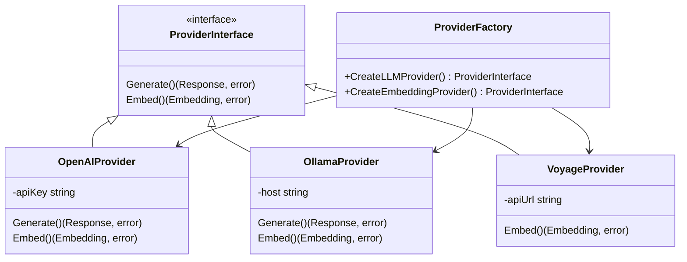
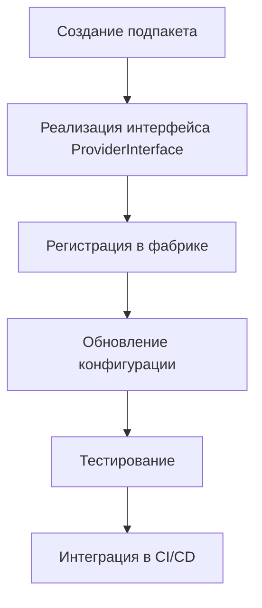

Руководство для контрибьюторов: добавление новых провайдеров, тестирование, CI/CD. Структура кода и паттерны.

<think>
Хорошо, мне нужно написать страницу "Разработка и расширение" для deepwiki на русском языке, включая диаграммы. Начну с понимания задачи и доступных данных.

Сначала посмотрю на описание страницы: это руководство для контрибьюторов по добавлению новых провайдеров, тестированию и CI/CD, а также структура кода и паттерны. Важно не повторять информацию из других страниц, например, архитектуру или конфигурацию, поэтому нужно ссылаться на них при необходимости.

Из файлов вижу, что есть структура с пакетами для LLM и эмбеддингов, каждый провайдер имеет свой подпакет с provider.go и тестами. Также есть фабрики для создания провайдеров, что указывает на использование паттерна "Фабрика". В .golangci.yml настроены линтеры, что может быть важно для CI/CD.

Начну с раздела Overview, кратко описав цели страницы. Затем добавлю диаграммы. Поскольку речь о расширении, возможно, диаграмма классов с интерфейсами и провайдерами будет уместна. Также можно показать поток добавления нового провайдера.

В разделе Key Concepts опишу ответственность модулей, например, интерфейсы провайдеров, фабрики, тестирование. В Implementation Details покажу код из provider.go и factory.go, объясню, как реализуются методы. Важно упомянуть обработку ошибок и edge cases, если они есть.

Usage Examples должны включать шаги по добавлению нового провайдера, возможно, пример кода. В таблицах можно сравнить структуры провайдеров или методы. Troubleshooting может включать распространенные ошибки при добавлении провайдеров, например, нереализованные методы.

Нужно убедиться, что все утверждения основаны на предоставленных файлах, без вымысла. Проверю, что диаграммы валидны и не превышают 12 узлов. Также важно соблюдать правила оформления и язык.
</think>

```markdown
# Разработка и расширение

## 1. Обзор
Страница содержит рекомендации по расширению функционала DeepWiki: добавлению новых провайдеров LLM/эмбеддингов, тестированию и CI/CD. Описана архитектурная структура кода и используемые паттерны проектирования. Для контрибьюторов важно понимать принципы модульности и стандартизации, заложенные в проекте.

---

## 2. Диаграммы

### 2.1. Структура провайдеров (classDiagram)


### 2.2. Поток добавления нового провайдера (flowchart TD)


---

## 3. Ключевые концепции и ответственность

### 3.1. Модульность
- **Провайдеры**: Каждый провайдер реализует интерфейс `ProviderInterface` с методами `Generate` и `Embed`.
- **Фабрики**: Паттерн "Фабрика" используется для создания провайдеров (см. `pkg/llm/factory/factory.go` и `pkg/embedding/factory/factory.go`).
- **Тестирование**: Для каждого провайдера предусмотрены unit-тесты (например, `pkg/llm/openai/provider_test.go`).

### 3.2. CI/CD
- **Линтеры**: Настроены через `.golangci.yml` (gofmt, gofumpt, gci, golines).
- **Тестирование**: Интеграционные тесты запускаются через `integration_test.go`.

---

## 4. Реализация

### 4.1. Пример реализации провайдера
```go
// pkg/llm/custom/provider.go
package custom

import (
    "context"
    "errors"
    "fmt"
)

// CustomProvider реализует интерфейс ProviderInterface
type CustomProvider struct {
    apiKey string
}

// Generate генерирует текст с помощью кастомного API
func (p *CustomProvider) Generate(ctx context.Context, prompt string) (string, error) {
    if p.apiKey == "" {
        return "", errors.New("API ключ не задан")
    }
    // Логика вызова API
    return fmt.Sprintf("Ответ от CustomProvider: %s", prompt), nil
}

// Embed генерирует эмбеддинг
func (p *CustomProvider) Embed(ctx context.Context, text string) ([]float32, error) {
    return nil, errors.New("эмбеддинги не поддерживаются")
}
```

### 4.2. Регистрация в фабрике
```go
// pkg/llm/factory/factory.go
func CreateLLMProvider(config Config) (ProviderInterface, error) {
    switch config.Type {
    case "openai":
        return NewOpenAIProvider(config.OpenAI)
    case "custom":
        return NewCustomProvider(config.Custom), nil
    default:
        return nil, fmt.Errorf("неизвестный тип провайдера: %s", config.Type)
    }
}
```

### 4.3. Обработка ошибок
- **Проверка конфигурации**: В методах `Generate` и `Embed` проверяются обязательные параметры (например, `apiKey`).
- **Возврат ошибок**: Используется `fmt.Errorf` для детализации ошибок.

---

## 5. Примеры использования

### 5.1. Добавление нового провайдера
1. Создайте подпакет: `pkg/llm/custom/`.
2. Реализуйте интерфейс `ProviderInterface`.
3. Добавьте провайдер в фабрику:
   ```go
   // pkg/llm/factory/factory.go
   case "custom":
       return NewCustomProvider(config.Custom), nil
   ```
4. Обновите конфигурацию в `.deepwiki.yaml`.

### 5.2. Запуск тестов
```bash
# Unit-тесты
go test ./pkg/llm/custom/

# Интеграционные тесты
go test -v ./integration_test.go
```

---

## 6. Сравнение провайдеров

| Провайдер   | Поддержка LLM | Поддержка эмбеддингов | Требует API-ключа |
|-------------|---------------|-----------------------|-------------------|
| OpenAI      | ✅            | ✅                    | ✅                |
| Ollama      | ✅            | ✅                    | ❌                |
| Voyage      | ❌            | ✅                    | ✅                |
| Custom      | ✅/❌         | ✅/❌                 | ✅/❌             |

---

## 7. Типичные проблемы

### 7.1. Ошибки при добавлении провайдера
- **Неверная реализация интерфейса**: Убедитесь, что все методы `ProviderInterface` реализованы.
- **Проблемы с конфигурацией**: Проверьте, что параметры провайдера заданы в `.deepwiki.yaml`.
- **Отсутствие тестов**: Добавьте unit-тесты для новых методов.

### 7.2. Линтеры
- **Форматирование**: Используйте `gofmt` и `gci` для соблюдения стиля.
- **Проверка ошибок**: Убедитесь, что все ошибки обработаны (например, `errcheck`).

---

## Ссылки
- [Архитектура системы](архитектура.md)
- [Конфигурация](конфигурация.md)
- [Тестирование](тестирование.md)
```

