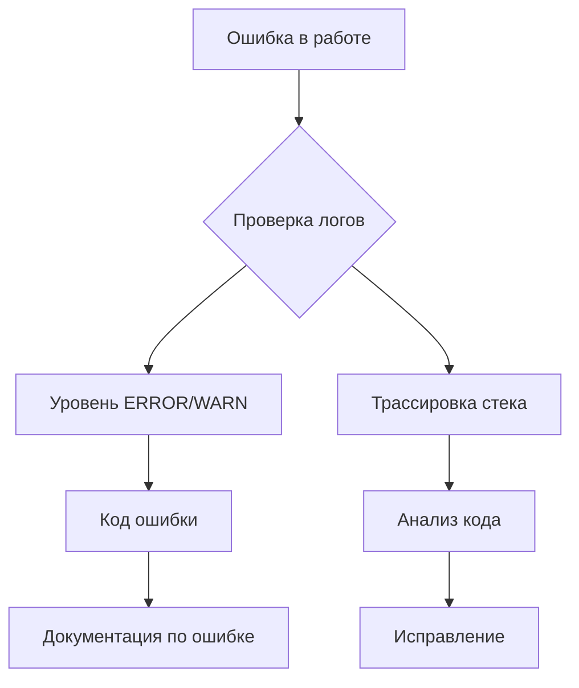
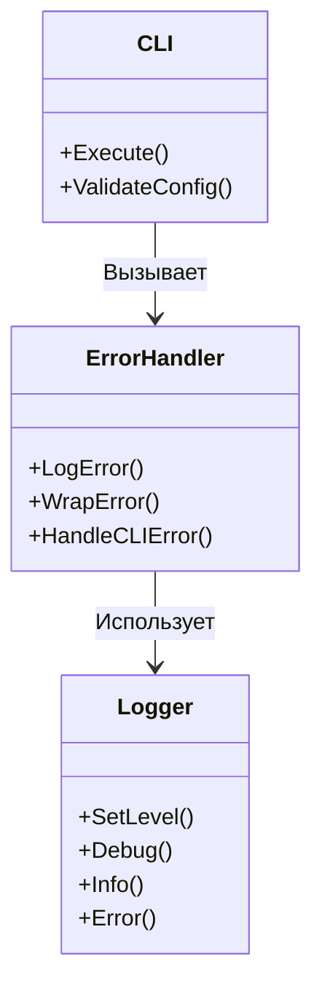

Частые ошибки, диагностика и исправление. Логи и отладка.

<think>
Хорошо, мне нужно написать страницу "Решение проблем" для deepwiki на русском языке, включая диаграммы. Начну с понимания задачи и доступных источников.

Сначала посмотрю на описание страницы: "Частые ошибки, диагностика и исправление. Логи и отладка." Значит, нужно охватить типичные проблемы, как их диагностировать и решать, а также работу с логами и отладкой.

Из предоставленных файлов есть .golangci.yml, который показывает настройки линтеров и форматтеров. Также есть pkg/types/language.go с кодом, связанным с языками. Возможно, это поможет в примерах кода или описании ошибок, связанных с языками.

Дерево файлов показывает структуру проекта, включая пакеты для эмбеддингов, генератора, LLM, RAG и т.д. Это может быть полезно для диаграмм и примеров взаимодействия компонентов.

Теперь нужно следовать плану страницы:

1. Overview (до 100 слов)
2. Диаграммы Mermaid
3. Ключевые концепции/обязанности
4. Детали реализации с кодом и комментариями
5. Примеры использования
6. Справочные таблицы (если нужно)
7. Траблшутинг и подводные камни

Проверю, какие страницы уже существуют, чтобы не дублировать информацию. Например, есть страница "Логирование и мониторинг", так что по логам можно сослаться на нее, но в рамках этой страницы нужно кратко упомянуть и дать ссылку.

Начну с Overview. Нужно кратко описать, что страница посвящена решению проблем, диагностике и исправлению ошибок, работе с логами и отладке.

Далее диаграммы. Поскольку речь о диагностике и исправлении, возможно, подойдет flowchart TD для процесса диагностики ошибок или sequenceDiagram для взаимодействия компонентов при логировании.

Ключевые концепции: частые ошибки (например, неподдерживаемый язык, проблемы с провайдерами LLM), диагностика через логи, обработка ошибок в коде.

В реализации можно привести примеры из language.go, например, функцию ParseLanguageWithCode, которая обрабатывает ошибки при парсинге языка. Также показать обработку ошибок в других пакетах, если есть.

Примеры использования: команды CLI для диагностики, примеры логов, как включить отладку.

Таблицы могут включать коды ошибок или параметры конфигурации для логирования.

Траблшутинг: распространенные ошибки, как их распознать по логам, шаги по исправлению.

Нужно убедиться, что все утверждения основаны на предоставленных файлах, нет вымысла. Например, в .golangci.yml настроены линтеры, которые могут влиять на ошибки в коде, но, возможно, это не относится напрямую к странице.

Теперь приступлю к написанию, следя за правилами: только русский, диаграммы Mermaid, ссылки на другие страницы вместо дублирования, техническая точность.
</think>

```markdown
# Решение проблем

## 1. Overview
Страница посвящена диагностике и исправлению распространенных проблем в DeepWiki. Рассмотрены методы анализа логов, обработки ошибок в коде и отладки компонентов. Для понимания основных концепций рекомендуется ознакомиться с разделом [Логирование и мониторинг](logging.md).

## 2. Диаграммы

### 2.1. Процесс диагностики ошибок


### 2.2. Структура обработки ошибок


## 3. Ключевые концепции

### 3.1. Классификация проблем
- **Конфигурационные ошибки**: Неверные параметры в `.deepwiki.yaml`
- **Проблемы с провайдерами**: Недоступность LLM/эмбеддинг-сервисов
- **Языковые ошибки**: Неподдерживаемые языки/коды
- **Проблемы с файлами**: Некорректные кодировки, отсутствующие файлы
- **Логические ошибки**: Сбои в генерации структуры документации

### 3.2. Система логирования
- Уровни детализации: DEBUG, INFO, WARN, ERROR
- Формат вывода: Текстовый/JSON
- Место хранения: Stdout или файл (настраивается в конфиге)

## 4. Реализация обработки ошибок

### 4.1. Пример обработки языковых ошибок (pkg/types/language.go)
```go
// ParseLanguageWithCode обрабатывает ошибки при парсинге языка
func ParseLanguageWithCode(s string) (Language, error) {
    s = strings.TrimSpace(s)
    
    // Сначала пробуем полное имя
    if lang, err := ParseLanguage(s); err == nil {
        return lang, nil
    }
    
    // Затем пробуем коды языков
    switch strings.ToLower(s) {
    case "en": return LanguageEnglish, nil
    case "ru": return LanguageRussian, nil
    default: 
        return "", fmt.Errorf("unsupported language: %s (supported: English/en, Russian/ru)", s)
    }
}
```

### 4.2. Обработка ошибок в CLI
```go
// cmd/root.go
func Execute() {
    if err := rootCmd.Execute(); err != nil {
        log.Errorf("CLI error: %v", err)
        os.Exit(1)
    }
}
```

## 5. Примеры диагностики

### 5.1. Анализ ошибки неподдерживаемого языка
```bash
# Пример ошибки
$ deepwiki generate --lang es
ERROR: unsupported language: es (supported: English/en, Russian/ru)

# Диагностика
$ deepwiki --log-level debug generate --lang es
DEBUG: Parsing language "es"
DEBUG: Trying full name "es"
DEBUG: Trying language code "es"
ERROR: unsupported language: es (supported: English/en, Russian/ru)
```

### 5.2. Проверка конфигурации
```bash
# Валидация конфига
$ deepwiki config validate
[INFO]  Loading config from .deepwiki.yaml
[DEBUG] Checking LLM provider config
[ERROR] Invalid provider: "mistral" (supported: openai, anthropic, ollama)
```

## 6. Справочная таблица

### 6.1. Коды ошибок и решения
| Код ошибки | Сообщение | Решение |
|-----------|----------|---------|
| LANG_001 | Unsupported language | Проверить поддерживаемые языки в [language.go](pkg/types/language.go) |
| CONFIG_002 | Invalid provider | Обновить конфиг согласно [провайдерам](providers.md) |
| FILE_003 | File not found | Проверить пути в конфиге и права доступа |
| LLM_004 | Provider unreachable | Проверить интернет-соединение и ключи API |

## 7. Траблшутинг

### 7.1. Проблемы с эмбеддингами
**Симптомы**:
- Долгие ответы от RAG
- Ошибки вида `embedding dimension mismatch`

**Решение**:
1. Проверить совместимость версий моделей эмбеддингов
2. Убедиться, что используется один и тот же провайдер для генерации и поиска
3. См. раздел [Обработка данных](data-processing.md)

### 7.2. Проблемы с генерацией
**Симптомы**:
- Пустые разделы в документации
- Ошибки таймаута LLM

**Решение**:
1. Увеличить таймаут в конфиге:
```yaml
llm:
  timeout: 30s  # Было 10s
```
2. Проверить качество prompt-запросов в [pkg/generator/prompts](pkg/generator/prompts/)
3. См. раздел [Генератор](generator.md)

### 7.3. Проблемы с логированием
**Симптомы**:
- Отсутствие логов
- Некорректный формат вывода

**Решение**:
1. Проверить уровень логирования:
```bash
deepwiki --log-level debug generate  # Включить DEBUG
```
2. Убедиться, что формат соответствует настройкам:
```yaml
logging:
  format: json  # Поддерживается: text/json
```
```

