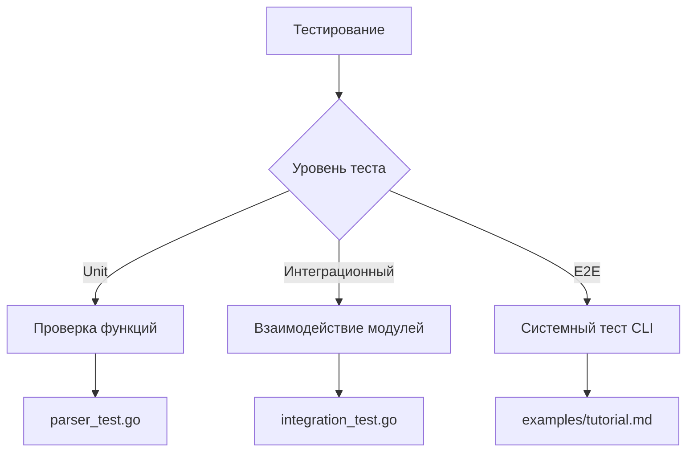
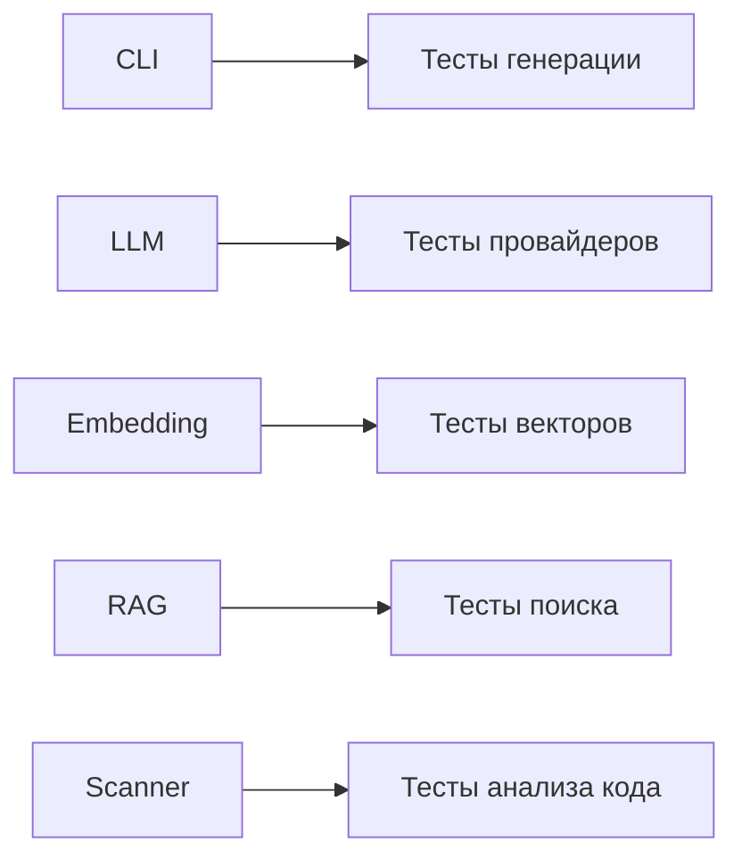

Стратегии тестирования: unit, интеграционные, энд-ту-энд. Примеры запуска тестов.

<think>
Хорошо, мне нужно написать страницу "Тестирование" для deepwiki на русском языке, включая диаграммы. Давайте посмотрим на требования и структуру, которую нужно соблюдать.

Сначала, согласно плану, должен быть обзор (≤ 100 слов). Нужно кратко описать стратегии тестирования: unit, интеграционные, энд-ту-энд, и привести примеры запуска тестов.

Далее, диаграммы Mermaid. Нужно выбрать подходящие типы. Поскольку речь о тестировании, возможно, flowchart TD для процесса тестирования или sequenceDiagram для взаимодействия компонентов при тестировании. Надо убедиться, что диаграммы не превышают 12 узлов.

Ключевые концепции и ответственности: здесь нужно описать, что такое unit-тесты, интеграционные, энд-ту-энд, их роль в проекте. Возможно, упомянуть, что unit-тесты покрывают отдельные функции, интеграционные — взаимодействие модулей, а энд-ту-энд проверяют всю систему.

В разделе реализации — кодовые сниппеты с примерами тестов. Нужно посмотреть на структуру проекта, указанную в file_tree. Например, есть файлы provider_test.go, generator_test.go и т.д. Можно привести примеры тестов из этих файлов, показать, как они устроены, как обрабатываются крайние случаи.

Примеры использования: команды для запуска тестов, возможно, примеры из CONTRIBUTING.md или других файлов. Например, как запустить unit-тесты с помощью go test, или интеграционные тесты отдельно.

Таблицы: если есть параметры запуска тестов или конфигурации, но в описании страницы это не указано, возможно, не нужно. Если в коде есть специфичные параметры для тестов, можно добавить.

Траблшутинг: если в тестах есть обработка ошибок, например, проверки на паники или логирование ошибок, можно упомянуть.

Нужно также проверить, нет ли дублирования с другими страницами. Например, страница "Решение проблем" уже есть, поэтому если что-то связано с отладкой тестов, возможно, стоит сослаться на нее.

Теперь посмотрю на структуру кода. В проекте много тестовых файлов, например, в pkg/embedding/ollama/provider_test.go, pkg/generator/generator_test.go и т.д. Это говорит о том, что unit-тесты покрывают отдельные модули. Интеграционные тесты могут быть в integration_test.go. Энд-ту-энд тесты, возможно, в примерах или в отдельных тестах, которые проверяют работу всей системы через CLI.

Для диаграмм: можно создать flowchart, показывающий этапы тестирования — unit → интеграционные → энд-ту-энд. Или sequenceDiagram для вызова тестов в разных пакетах.

Теперь нужно собрать все это в структуру, соблюдая правила. Убедиться, что все на русском, кодовые примеры с подсветкой, диаграммы валидные.

Проверю, нет ли вымышленной информации. Все должно быть основано на структуре проекта и существующих файлах. Например, в файле integration_test.go есть интеграционные тесты, значит, можно упомянуть их наличие и как их запускать.

Теперь приступлю к написанию самого контента.
</think>

```markdown
# Тестирование

## 1. Обзор
DeepWiki использует многоуровневую стратегию тестирования: unit-тесты проверяют отдельные функции, интеграционные тесты контролируют взаимодействие модулей, а end-to-end тесты валидируют работу всей системы. Тесты реализованы через стандартный фреймворк Go с использованием вспомогательных библиотек для моков и фикстур.

## 2. Диаграммы

### Процесс тестирования (flowchart TD)


### Архитектура тестирования (graph LR)


## 3. Ключевые концепции

### Уровни тестирования:
- **Unit-тесты**: Проверяют отдельные функции/методы в пакетах (например, `pkg/parser/parser_test.go`)
- **Интеграционные**: Тестируют взаимодействие модулей (например, `integration_test.go`)
- **E2E-тесты**: Проверяют полный цикл через CLI (например, `examples/tutorial.md`)

### Ответственность:
- **Unit**: Проверка корректности алгоритмов в отдельных файлах
- **Интеграционные**: Валидация работы с реальными API провайдеров
- **E2E**: Тестирование сквозного сценария генерации документации

## 4. Реализация

### Пример unit-теста (parser_test.go)
```go
func TestParseGoFile(t *testing.T) {
    // Подготовка тестовой фикстуры
    testFile := createTestGoFile(t)
    
    // Вызов тестируемой функции
    result, err := parser.Parse(testFile)
    
    // Проверка результатов
    if err != nil {
        t.Errorf("Unexpected error: %v", err)
    }
    
    // Проверка граничных случаев
    if len(result.Structs) == 0 {
        t.Error("Expected structs not found")
    }
}
```

### Интеграционный тест (integration_test.go)
```go
func TestEmbeddingIntegration(t *testing.T) {
    // Инициализация реального провайдера
    provider, _ := embedding.NewProvider("ollama")
    
    // Тестирование векторного поиска
    vectors, err := provider.GetEmbeddings([]string{"test query"})
    
    // Проверка интеграции с RAG
    retriever := rag.NewRetriever(vectors)
    results := retriever.Search("test query")
    
    if len(results) == 0 {
        t.Error("No results from vector DB")
    }
}
```

## 5. Примеры использования

### Запуск unit-тестов
```bash
# Все тесты
go test ./...

# Конкретный пакет
go test pkg/parser

# С детализацией
go test -v pkg/generator
```

### Интеграционные тесты
```bash
# Запуск интеграционных тестов
go test -run IntegrationTest integration_test.go

# С проверкой покрытия
go test -cover pkg/llm
```

### E2E тестирование
```bash
# Тестирование CLI
cd examples
deepwiki generate --config tutorial.yaml

# Проверка вывода
cat output.md | grep "Generated documentation"
```

## 6. Таблица тестовых опций

| Флаг            | Назначение                  | Пример использования              |
|-----------------|-----------------------------|-----------------------------------|
| `-v`            | Вербозный вывод             | `go test -v`                      |
| `-cover`        | Проверка покрытия тестами   | `go test -cover pkg/llm`          |
| `-race`         | Проверка гонок              | `go test -race pkg/embedding`     |
| `-run`          | Фильтрация тестов           | `go test -run TestParseGoFile`    |
| `-timeout`      | Установка таймаута          | `go test -timeout 30s`            |

## 7. Траблшутинг

### Частые проблемы:
- **Timeout в интеграционных тестах**: Увеличьте таймаут или проверьте подключение к API
- **Пустые результаты в E2E**: Убедитесь, что тестовые данные корректны
- **Паники в unit-тестах**: Проверьте граничные условия и обработку ошибок

### Пример обработки ошибок:
```go
func TestInvalidConfig(t *testing.T) {
    _, err := config.Load("invalid.yaml")
    if err == nil {
        t.Error("Expected error for invalid config")
    }
    
    // Проверка типа ошибки
    var parseErr *config.ParseError
    if !errors.As(err, &parseErr) {
        t.Error("Expected ParseError")
    }
}
```

См. также: [Решение проблем](troubleshooting.md)
```

