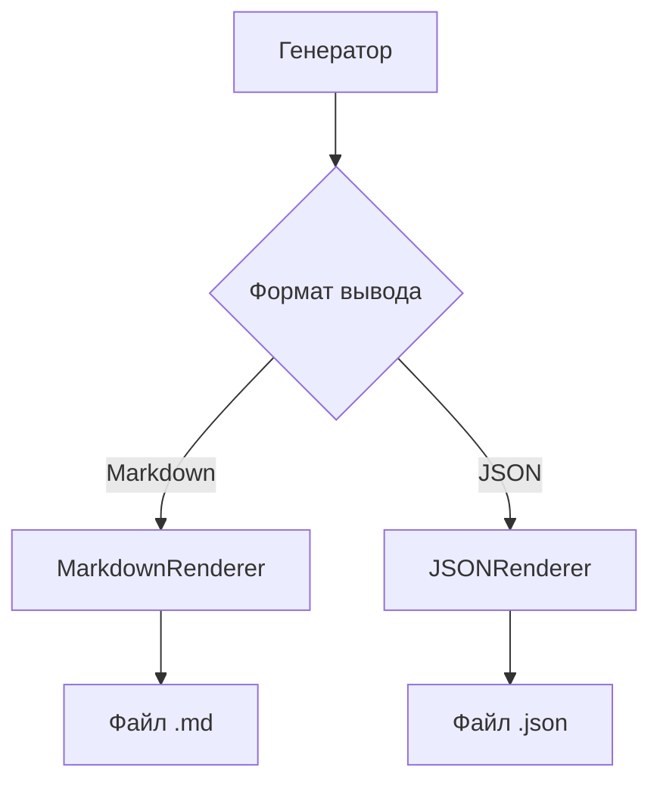
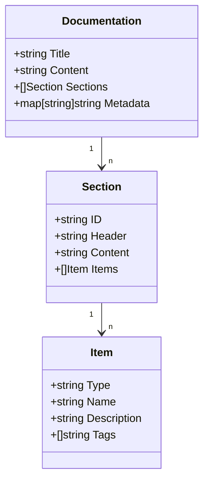

Поддерживаемые форматы документации: Markdown, JSON. Примеры структуры выходных файлов.

# Форматы вывода

## 1. Обзор

DeepWiki поддерживает два формата вывода документации:

- **Markdown** - для человекочитаемой документации с разметкой
- **JSON** - для машинного потребления и интеграций

Формат вывода задается в конфигурации проекта (см. [Конфигурация](/docs/конфигурация.md)). Оба формата содержат одинаковую информацию, но структурированы по-разному.

## 2. Диаграммы

### Процесс генерации вывода



### Структура данных JSON



## 3. Ключевые концепции

### Markdown

- Основной формат для документации
- Использует стандартную разметку GitHub
- Поддерживает:
  - Заголовки
  - Списки
  - Таблицы
  - Кодовые блоки
  - Ссылки

### JSON

- Машиночитаемый формат
- Содержит:
  - Метаданные проекта
  - Структурированные разделы
  - Детализированные элементы
  - Теги и ссылки

## 4. Реализация

### Генерация Markdown (generator.go)

```go
func (g *Generator) GenerateMarkdown(doc *Documentation) (string, error) {
    var sb strings.Builder

    // Заголовок
    sb.WriteString("# " + doc.Title + "\n\n")

    // Метаданные
    sb.WriteString("## Метаданные\n")
    for k, v := range doc.Metadata {
        sb.WriteString(fmt.Sprintf("- %s: %s\n", k, v))
    }

    // Секции
    for _, section := range doc.Sections {
        sb.WriteString("\n## " + section.Header + "\n")
        sb.WriteString(section.Content + "\n")

        // Элементы
        for _, item := range section.Items {
            sb.WriteString("\n### " + item.Name + "\n")
            sb.WriteString(item.Description + "\n")
            sb.WriteString("\n**Теги:** " + strings.Join(item.Tags, ", "))
        }
    }

    return sb.String(), nil
}
```

### Генерация JSON (json_renderer.go)

```go
type JSONOutput struct {
    Title      string          `json:"title"`
    Metadata   map[string]string `json:"metadata"`
    Sections   []JSONSection   `json:"sections"`
}

type JSONSection struct {
    ID       string    `json:"id"`
    Header   string    `json:"header"`
    Content  string    `json:"content"`
    Items    []JSONItem `json:"items"`
}

func (g *Generator) GenerateJSON(doc *Documentation) ([]byte, error) {
    output := JSONOutput{
        Title:    doc.Title,
        Metadata: doc.Metadata,
        Sections: make([]JSONSection, len(doc.Sections)),
    }

    for i, section := range doc.Sections {
        jsonSec := JSONSection{
            ID:      section.ID,
            Header:  section.Header,
            Content: section.Content,
            Items:   make([]JSONItem, len(section.Items)),
        }

        for j, item := range section.Items {
            jsonSec.Items[j] = JSONItem{
                Type:        item.Type,
                Name:        item.Name,
                Description: item.Description,
                Tags:        item.Tags,
            }
        }

        output.Sections[i] = jsonSec
    }

    return json.MarshalIndent(output, "", "  ")
}
```

## 5. Примеры использования

### Markdown вывод

```markdown
# Пример документации

## Метаданные

- project: deepwiki
- version: 1.0.0

## Введение

Это пример документации в формате Markdown.

### Элемент 1

Описание первого элемента

**Теги:** example, markdown
```

### JSON вывод

```json
{
  "title": "Пример документации",
  "metadata": {
    "project": "deepwiki",
    "version": "1.0.0"
  },
  "sections": [
    {
      "id": "intro",
      "header": "Введение",
      "content": "Это пример документации в формате JSON.",
      "items": [
        {
          "type": "example",
          "name": "Элемент 1",
          "description": "Описание первого элемента",
          "tags": ["example", "json"]
        }
      ]
    }
  ]
}
```

## 6. Справочные таблицы

### JSON формат: основные поля

| Поле                | Тип    | Описание                         |
| ------------------- | ------ | -------------------------------- |
| title               | string | Заголовок документации           |
| metadata            | object | Дополнительные метаданные        |
| sections            | array  | Массив разделов документации     |
| sections[].id       | string | Уникальный идентификатор раздела |
| sections[].header   | string | Заголовок раздела                |
| sections[].content  | string | Основное содержание раздела      |
| sections[].items    | array  | Элементы в разделе               |
| items[].type        | string | Тип элемента                     |
| items[].name        | string | Название элемента                |
| items[].description | string | Описание элемента                |
| items[].tags        | array  | Теги элемента                    |

## 7. Особенности и подводные камни

### Обработка ошибок

```go
// Проверка поддерживаемых форматов
func ValidateOutputFormat(format string) error {
    supported := map[string]bool{
        "markdown": true,
        "json": true,
    }

    if !supported[format] {
        return fmt.Errorf("неподдерживаемый формат вывода: %s. Доступные: markdown, json", format)
    }

    return nil
}
```

### Частые ошибки

1. **Неподдерживаемый формат** - Убедитесь, что в конфигурации указан `markdown` или `json`
2. **Некорректная кодировка JSON** - Используйте `json.MarshalIndent` для отладки
3. **Потерянные метаданные** - Проверьте, что все поля заполнены в генераторе
4. **Несовпадение структур** - Используйте одинаковые ID для секций в обоих форматах
